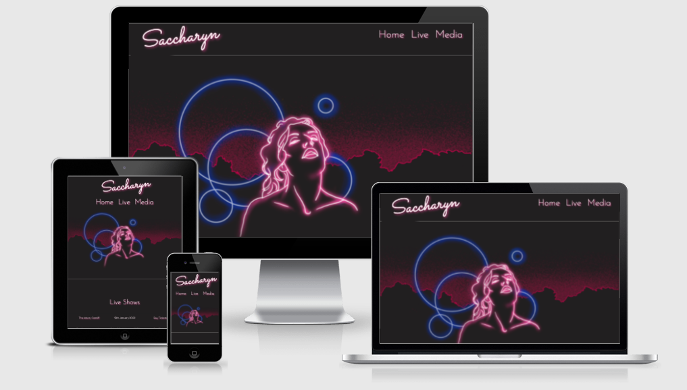

# Saccharyn Website

This is the main website for a musician called Saccharyn. It is designed to be accessible and responsive across different devices. The style is simple in order to make it easy for fans and potential music industry professionals to easily find information relating to the musician's live show dates, social media profiles and media content. There is also a form where visitors can add their e-mails to receive the artist's newsletter. 

---

## User Experience (UX)

* User Stories

    + First time visitor goals:

        a. As a first time visitor I want to understand the purpose of the website.

        b. I want to be able to easily navigate the site and its contents.

        c. I want to be able to find links to external social media profiles.

        d. I want to find media content showcasing the artist’s music.

        ---

    + Returning visitor:

        a. As a returning visitor I want to find news on any upcoming releases or shows the artist has lined up.

        b. I want to find functioning links to social media profiles where there may be new posts from the artist.

        ---

    + Frequent visitor:

        a. As a frequent visitor I want to find updates from the artist about new shows or releases.

        b. I want to be able to sign up to a newsletter in order to receive frequent updates from the artist on their upcoming releases and shows.
    
    ---

* Design

    + Colour scheme:
        
        - The colours chosen were picked using the [Eye Dropper](https://eyedropper.org/) extension on Google Chrome to pick out the colours used in the imagery provided for use on the website. A dark gray colour was picked from the background of the main logo image to use for continuity purposes in different sections of the website, providing a seamless quality between images and background. A pink hue and a blue hue offering sufficient contrast between the background grey and any lettering used were also picked from the hero image using the Eye Dropper.

        ---

    + Typography:

        - [Google Fonts](https://fonts.google.com/) was used to source the main fonts used on this website.
        - The Sacramento font was used for the navigation bar writing and section headers as it most closely resembled the handwritten style of the main logo, whilst also being readable.
        - The Josefin Sans font was used for the writing on the rest of the website, in order to make the smaller fonts more readable.
        - Sans Serif was chosen as the fallback font in case either of the above fonts failed to be imported.
        - This [website](https://kevq.uk/whats-in-a-font-researching-website-typography/) was consulted when making choices regarding the typography to the used on the website. 

        ---

    + Imagery:

        - The image chosen was commissioned by the artist for use in social media websites and other marketing materials, including this website. The image is that of a bust of the artist in a neon-pink glow outline with blue and pink background details. The image has a very dark grey background colour, which is used throughout the body of the website to create a seamless effect.
        - The bust image was used as a hero image.
        - Imagery is very important as it ties together with all marketing materials relating to the artist, including social media profiles and pages on services such as [Spotify](https://open.spotify.com/artist/7BrG3qmLmDp8B30dzd657d).

        ---

    + Responsiveness:
    
        - The website design is minimalist by nature, so I wanted to keep the design fairly similar for different device sizes.
        - The main difference between desktop and mobile device design is the positioning of the title "Saccharyn" and the navigation menu links. In larger screen sizes the title is floated to the left and the navigation menu is floated to the right. In smaller screen sizes the title sits on top of the navigation menu.
        - A "burger" menu button was considered for small (under 480px) screen sizes, however, as there are only 3 items on the navigation menu, which fit neatly even in smaller screen sizes, it was deemed that it would be better user experience with fewer clicks to have the full meny displayed on screen rather than the extra clicks to open the burger menu with the options.
        - As the website develops and expands in future, a "burger" menu will be considered for smaller screens as the navigation menu item number also expands (for instance to include a "News" section).

    ---

* Wireframes

    + [Desktop Wireframe](assets/images/wireframe1.png)
    + [Tablet Wireframe](assets/images/wireframe2.png)
    + [Mobile Wireframe](assets/images/wireframe3.png)

---

## Features

* Responsive on all device sizes

---

## Technologies Used

* Languages Used
    + [HTML5](https://kevq.uk/whats-in-a-font-researching-website-typography/)
    + [CSS3](https://en.wikipedia.org/wiki/CSS)

    ---

* Frameworks, Libraries and Programs Used
    + [Bootstrap 4.5](https://getbootstrap.com/docs/4.5/getting-started/introduction/)
        - Bootstrap was used to assist with responsiveness and styling of website.

    + [Google Fonts](https://fonts.google.com/)
        - Google Fonts was used to import 'Sacramento' and 'Josefin Sans' fonts into the style.css file which is used throughout the project
    
    + [Font Awesome](https://fontawesome.com/)
        - Font Awesome was used to source the social media icons found on the footer of the website
    
    + [Git](https://git-scm.com/)
        - Git was used for version control by utilizing the Gitpod terminal to commit to Git and Push to GitHub.
    
    + [GitHub](https://github.com/)
        - GitHub was used to store the projects code after being pushed from Git.
    
    + [Balsamiq](https://balsamiq.com/)
        - Balsamiq was used to create the wireframes for the project.

---

## Testing

* Bugs Discovered

    + Navigation logo issue:

        - An image was provided of the word 'Saccharyn' written in neon pink to be used as the logo for the header of the website, however this image did not fit with the style of the header bar, as it was too small for its purpose and increasing its size meant increasing the height of the header, pushing the hero image further down, which affected the overall design of the page.

        - The logo image was resized and moved around, cropped and resized, however the issue persisted. It was also found during this process that the colours used in this logo differed from the colours used in the hero image, which looked inconsistent when generating the colour palette for the website.

        - As a result it was decided that the logo image would be replaced by text styled with CSS using the colour palette from the hero image to be consistent with the pink neon light effect by using a text-shadow property. This also meant a hover pseudo-class could be employed to alter the colour of the text logo when being hovered over, which was not possible with a static image.

        - Overall using text was found to be a more elegant solution for making the website more consistent, whilst also looking better in terms of design, improving user experience.

        - In future a new logo will be commissioned with different parameters to fit the spcifications of the website design, as the original logo provided was designed as a cover image for social media websites such as [Twitter](www.twitter.com), [Instagram](www.instagram.com) and [Facebook](www.facebook.com), and not designed with a website in mind.
    
        ---

    + Blue line near social media icons:
        - When hovering over the social media icons there was an unwanted blue line appearing to the right of the highlighted icon. I googled the issue and this appears to be a common issue when hovering over Font Awesome icons. I used the code suggesed [here](https://stackoverflow.com/questions/21983508/strange-underlines-in-font-awesome-css) which fixed the issue.

        ---

    + Padding issue on footer:
        - I noticed the footer icons were not centred properly on the screen and were pushed up further from the bottom of the screen than intended. Using Dev Tools on Chrome I noticed there was a 40px padding on the left pushing the icons off-centre and also 1rem margin pushing the icons up. I overrode this padding and margin inherited from Bootstrap for ul elements by specifying padding and margin as 0 in the class selected for the footer in the stylesheet.

        ---
        
    + Centering issue with nav in media query:
        - I was initially unable to center the menu bar when using a media query for screens smaller in width than 1024px by using the text-align property, as Bootstrap styling overrode this to justify the nav elements to the right. I used Dev Tools on Chrome to view the specifc rule being applied to this, which was "justify-content: flex-end!important;". I overrode this by specifying in the media query section for the .justify-content-end class "justify-content: center!important;". I needed to add the "!important" part in order for the media query to override the Bootstap style.

    ---

* W3C Markup Validator
    The W3C Markup Validator and W3C CSS Validator Services were used to validate every page of the project to ensure there were no syntax errors in the project.
    + [W3C Markup Validator](https://validator.w3.org/) - Results page [1](assets/images/html-validation-1.jpg)
    + [W3C CSS Validator](https://jigsaw.w3.org/css-validator/) - Results page [1](assets/images/css-validation-1.jpg) - [2](assets/images/css-validation-2.jpg) - [3](assets/images/css-validation-3.jpg) - [4](assets/images/css-validation-4.jpg) - [5](assets/images/css-validation-5.jpg) - [6](assets/images/css-validation-6.jpg)
    ---

* Testing User Stories from User Experience (UX) Section
    + First time visitor goals:

        - As a first time visitor I want to understand the purpose of the website:
            - Upon entering the website the visitor is greeted with the title of the page and navigation bar to go directly to the desired part of the website.
            - The hero image is featured prominently, displaying the main marketing image for the artist.
            - The user can either click one of the options on the navigation bar or scroll down for more content.

            ---

        - I want to be able to easily navigate the site and its contents.
            - The website is organised in a simple one page format with a navigation bar at the top to take the user directly to the section they are interested in.
            - The user may also scroll down the website for all its contents.
            - On the confirmation page after the user enters an e-mail to sign-up to the newsletter there is a clear link to click to go back to the main website.

            ---

        - I want to be able to find links to external social media profiles.
            - There are links to external social media websites on the footer of the website.
            - Each link uses an icon identifying the social media profile in question.
            - Each link opens in a separate tab so not to take the user away from the website.

            ---

        - I want to find media content showcasing the artist’s music.
            - The media section of the website contains 4 music videos embedded featuring the artist performing live as well as music videos.

        ---

    + Returning visitor:

        - As a returning visitor I want to find news on any upcoming releases or shows the artist has lined up.
            - When visiting the website, the user can find upcoming live show dates by scrolling down to the Live Shows section of the website or clicking on the Live link on the nav bar.

            ---

        -  I want to find functioning links to social media profiles where there may be new posts from the artist.
            - There are links to external social media websites on the footer of the website.
            - Each link uses an icon identifying the social media profile in question.
            - Each link opens in a separate tab so not to take the user away from the website.
        ---

    + Frequent visitor:

        - As a frequent visitor I want to find updates from the artist about new shows or releases.
            - When visiting the website, the user can find upcoming live show dates by scrolling down to the Live Shows section of the website or clicking on the Live link on the nav bar.

            ---

        - I want to be able to sign up to a newsletter in order to receive frequent updates from the artist on their upcoming releases and shows.
            - At the bottom of the website page there is a form to submit the user's e-mail address to sign up for a newsletter from the artist.
  
    ---

* Further Testing
    + Carried out the following tests on the website links:
        |Action|Expected Behaviour|Outcome|
        |------|------------------|-------|
        |Click Home|Be directed to top of index.html page|Successful|
        |Click Live|Be directed to top of Live Shows section|Successful|
        |Click Media|Be directed to top of Media section|Successful|
        |Click The Moon, Cardiff|Be directed to homepage for The Moon website|Successful|
        |Click Buy Tickets|Be directed to webpage relating to live show|Successful|
        |Click Truefest, Hay-on-Wye|Be directed to homepage for Truefest website|Successful|
        |Click Buy Tickets|Be directed to webpage for ticket sales for Truefest|Successful|
        |Click Facebook icon|Be directed to Saccharyn Facebook profile|Successful|
        |Click Instagram icon|Be directed to Saccharyn Instagram profile|Successful|
        |Click Twitter icon|Be directed to Saccharyn Twitter profile|Successful|
        |Click Soundcloud icon|Be directed to Saccharyn Soundcloud profile|Successful|
        |Click Spotify icon|Be directed to Saccharyn Spotify profile|Successful|
        |Click Bandcamp icon|Be directed to Saccharyn Bandcamp profile|Successful|

    ---

    + Tested website on following devices:
        - Macbook Pro 2012 12"
        - iPhone 11 (landscape and portrait)
        - iMac 2019 27"
        - iPhone SE (landscape and portrait)
        - iPhone 8 Plus (landscape and portrait)

    ---

    + Tested website on following browsers:
        - [Safari](https://support.apple.com/en_GB/downloads/safari)
        - [Google Chrome](https://www.google.co.uk/chrome/?brand=FHFK&gclsrc=aw.ds&gclid=EAIaIQobChMI8fSgn4bu9AIVyxitBh1B4wpFEAAYASAAEgK1i_D_BwE)
        - [Firefox](https://www.mozilla.org/en-GB/firefox/new/)

    ---

    + Comments:
        - My mentor had an error when opening the Instagram link from the website, however as my mentor is located in a different part of the world this may have been due to a server issue in his location. He was able to fix this error however by force refreshing his page.
        - The newsletter form has been programmed with a landing page for aesthetic purposes and there is no working backend for this form, however this will be added to the final website once I have the skills to do so later in the programme.

---

## Deployment

* GitHub Pages

    The project was deployed to GitHub Pages using the following steps:
        1. Log in to GitHub and locate the [repository](https://github.com/marssaraiva/project1).
        2. At the top of the repository, click the "Settings" button (cogwheel icon).
        3. Scroll down and click "Pages" on the left-hand side (second from last option on the list).
        4. Under "Source", click the dropdown "Branch" and select "main".
        5. Click "Save".
        6. The page will refresh and notify the website is ready to be published and provide the link.
        7. It may take a few minutes for the website to be published on the link.

    ---

* Forking a GitHub Repository

    By forking the repository, a new copy of the same is made on your GitHub account, allowing you to view or make changes without affectin the original repository. This can be done following these steps:
        1. Log in to GitHub and locate the [repository](https://github.com/marssaraiva/project1).
        2. At the top of the repository, click the "Fork" button.
        3. You should now have a copy of the original repository in your GitHub account.

    ---

* Making a Local Clone

    Make a local clone of the repository by following these steps:
        1. Log in to GitHub and locate the [repository](https://github.com/marssaraiva/project1).
        2. At the top of the repository list of files click the "Code" button.
        3. To clone the repository using HTTPS click HTTPS and then copy the link.
        4. To clone the repository using SSH click SSH and then copy the link.
        5. To clone the repository using GitHub CLI click GitHub CLI and then copy the link.
        6. Open Terminal.
        7. Change the current working directory to the location where you want the cloned directory.
        8. Type git clone, and then paste the URL you copied earlier.
        9. Press enter and your local clone will be created.

    Please see [here](https://docs.github.com/en/repositories/creating-and-managing-repositories/cloning-a-repository#cloning-a-repository-to-github-desktop) for further information on cloning a repository.

---

## Credits

* Code

    + Adapted code from the Love Running exercise website for the hero image zoom effect in this website which can be found [here](https://learn.codeinstitute.net/courses/course-v1:CodeInstitute+CSE101+2020_Q2/courseware/be0e510a3aca4bccb6e0bba4cf7cf06b/83c6c94d55f44c79a3646810d80ce7a3/).

    + Used [Bootstrap4](https://getbootstrap.com/docs/4.5/getting-started/introduction/) throughout website for styling purposes, namely the naviation bar, the grid for the live shows content, and also for responsiveness across different devices.

    + Used [this code](https://stackoverflow.com/questions/21983508/strange-underlines-in-font-awesome-css) to fix issue with blue line appearing when hovering over Font Awesome icons on footer.

    ---

* Content

    + All content was written by the developer.

    ---

* Media

    + Hero image was created by [Sara Christova](https://www.sarachristova.com/).

    ---

* Acknowledgements

    + My mentor Dick Vlaanderen for his advice and feedback.

    + The tutor support at Code Institute for their assistance.

---